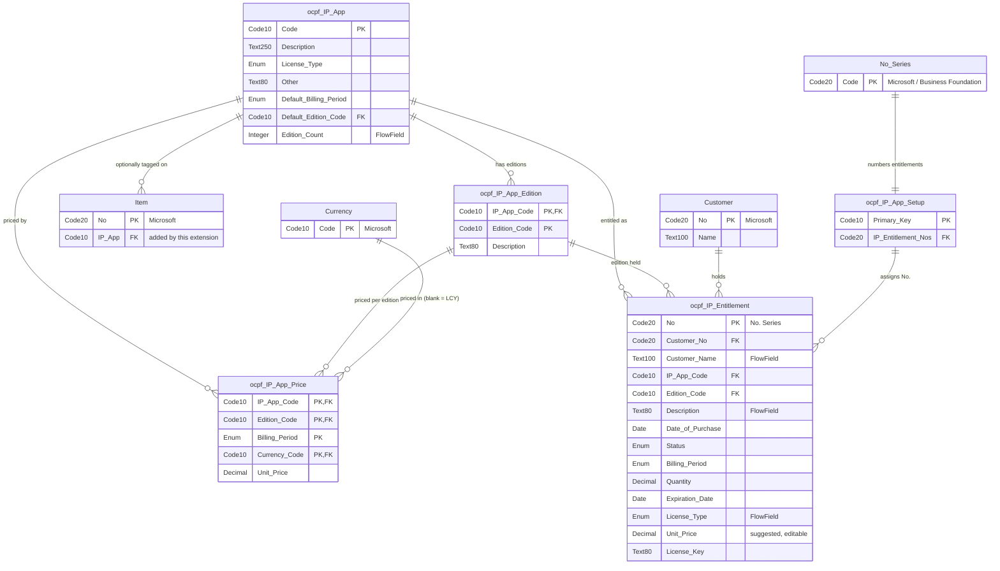

# IP Tracking — Consumer & Integration Reference

*Runbook phase: PROVE / Step 12 "Document the Code". Date: 2026-09-05. Extension version `1.2.0.1`.*

> **Generated from the code, not from memory.** Every field table below was extracted from `src/`
> by `scripts/extract_asbuilt.py` and pasted from its output — it cannot drift from the AL unless
> the extractor is re-run and this file is regenerated. Re-run it after any object change.

**Publisher:** OnlyCopilotFans · **Runtime:** 17.0 · **Requires:** BC 28.0.0.0+, Business Foundation

---

## 1. What this extension does

Records the intellectual-property software products the company licenses out, their editions and
prices, and the register of which customer holds which product and edition. Provides an in-client
UI (List/Card) and a v1.0 API surface over the same data.

---

## 2. Schema

Everything this extension owns, plus every standard BC table it touches. `ocpf`-prefixed entities
are ours; `Item`, `Customer`, `Currency` and `No. Series` are Microsoft's, shown to make the
integration points explicit.



**Standard tables touched:** `Item` (27) — gains an `IP App` field via `tableextension`;
`Customer` (18) — referenced by Entitlement, and gains a navigation action; `Currency` (4) —
referenced by Price; `No. Series` (308) — referenced by Setup.

---

## 3. API reference

**Base URL**

```
https://api.businesscentral.dynamics.com/v2.0/{tenantId}/{environment}
    /api/ocpf/ocpfIpManagement/v1.0/companies({companyId})/{entitySet}
```

**Authentication:** OAuth 2.0 (Microsoft Entra ID). Register an app registration with the
`API.ReadWrite.All` Business Central permission, grant admin consent, and send
`Authorization: Bearer <token>`. Basic auth is not supported on current BC online.

**Keys:** every entity uses `ODataKeyFields = SystemId`, so single-record addressing is
`/{entitySet}({systemId})` — a GUID, *not* the business key (`code`, `no`, …).

**Writes:** all four entity sets are writable (`DelayedInsert = true`). Individual fields marked
read-only below are calculated or system-assigned and will be rejected/ignored on write.
`PATCH` and `DELETE` require the current `@odata.etag` in an `If-Match` header.

### 3.1 Entity sets

#### `ocpfIPApps` — page 80315 `ocpf IP App API` (source: `ocpf IP App`)

| API field | Source field | Access |
|---|---|---|
| `code` | `Code` | read/write |
| `description` | `Description` | read/write |
| `licenseType` | `License Type` | read/write |
| `other` | `Other` | read/write |
| `defaultBillingPeriod` | `Default Billing Period` | read/write |
| `defaultEditionCode` | `Default Edition Code` | read/write |
| `editionCount` | `Edition Count` | read-only |
| `systemId` | `SystemId` | read-only |
| `lastModifiedDateTime` | `SystemModifiedAt` | read-only |

#### `ocpfIPAppEditions` — page 80316 `ocpf IP App Edition API` (source: `ocpf IP App Edition`)

| API field | Source field | Access |
|---|---|---|
| `ipAppCode` | `IP App Code` | read/write |
| `editionCode` | `Edition Code` | read/write |
| `description` | `Description` | read/write |
| `systemId` | `SystemId` | read-only |
| `lastModifiedDateTime` | `SystemModifiedAt` | read-only |

#### `ocpfIPAppPrices` — page 80317 `ocpf IP App Price API` (source: `ocpf IP App Price`)

| API field | Source field | Access |
|---|---|---|
| `ipAppCode` | `IP App Code` | read/write |
| `editionCode` | `Edition Code` | read/write |
| `billingPeriod` | `Billing Period` | read/write |
| `currencyCode` | `Currency Code` | read/write |
| `unitPrice` | `Unit Price` | read/write |
| `systemId` | `SystemId` | read-only |
| `lastModifiedDateTime` | `SystemModifiedAt` | read-only |

#### `ocpfIPEntitlements` — page 80318 `ocpf IP Entitlement API` (source: `ocpf IP Entitlement`)

| API field | Source field | Access |
|---|---|---|
| `no` | `No.` | read-only |
| `customerNo` | `Customer No.` | read/write |
| `customerName` | `Customer Name` | read-only |
| `ipAppCode` | `IP App Code` | read/write |
| `editionCode` | `Edition Code` | read/write |
| `description` | `Description` | read-only |
| `dateOfPurchase` | `Date of Purchase` | read/write |
| `status` | `Status` | read/write |
| `billingPeriod` | `Billing Period` | read/write |
| `quantity` | `Quantity` | read/write |
| `expirationDate` | `Expiration Date` | read/write |
| `licenseType` | `License Type` | read-only |
| `unitPrice` | `Unit Price` | read/write |
| `licenseKey` | `License Key` | read/write |
| `systemId` | `SystemId` | read-only |
| `lastModifiedDateTime` | `SystemModifiedAt` | read-only |

### 3.2 Enum values on the wire

| Field | Accepted values |
|---|---|
| `licenseType` | `" "` (blank, default), `Perpetual`, `FixedPricePerPeriod`, `PerUser`, `PerCompany`, `PerEnvironment`, `PerTenant`, `PerOther`, `Free`, `FreeOpenSource` |
| `billingPeriod` / `defaultBillingPeriod` | `" "` (blank, default), `Monthly`, `Annual`, `Triennial` |
| `status` | `Gratis`, `Active` (default), `Demo` |

### 3.3 Examples

```http
### metadata
GET {base}/$metadata

### list, filtered and projected
GET {base}/ocpfIPApps?$filter=licenseType eq 'PerUser'&$select=code,description,editionCount

### single record (SystemId, not code)
GET {base}/ocpfIPApps(1f0a…-…-…)

### create
POST {base}/ocpfIPApps
Content-Type: application/json
{ "code": "ACME1", "description": "Acme Platform", "licenseType": "PerUser" }

### update (etag required)
PATCH {base}/ocpfIPEntitlements(3b7c…-…-…)
If-Match: W/"JzQ0O…"
Content-Type: application/json
{ "status": "Active", "licenseKey": "XXXX-YYYY-ZZZZ" }

### delete
DELETE {base}/ocpfIPAppPrices(9d2e…-…-…)
If-Match: *
```

### 3.4 Integration patterns

- **Sync the catalogue:** poll `ocpfIPApps` and `ocpfIPAppEditions` on `lastModifiedDateTime`.
- **Price lookup:** read `ocpfIPAppPrices` filtered by `ipAppCode`, `editionCode`, `billingPeriod`; blank `currencyCode` is the LCY row.
- **Provision on sale:** `POST` to `ocpfIPEntitlements` with customer, app, edition, period and date. `no` is assigned server-side; `unitPrice` is suggested server-side if you omit it (send a value to override).
- **Expiry report:** `GET ocpfIPEntitlements?$filter=expirationDate lt 2026-12-31`.

---

## 4. Limitations — read before integrating

| Limitation | Detail |
|---|---|
| Entitlement `no` is not writable | Always assigned by the No. Series configured in IP App Setup. A blank/absent series makes **every** insert fail with `TestField` — configure it first |
| `unitPrice` suggestion uses `0` as its "unset" marker | Sending/leaving `0` may be overwritten by the suggested price if app/edition/period change later. Send a non-zero value to make it stick |
| `licenseType` and `description` on Entitlement are read-only | They're FlowFields sourced from IP App / IP App Edition — change them at the source |
| Deletes are blocked, not cascaded | Deleting an IP App with editions, prices, entitlements **or tagged Items** returns a clean error. Same for an Edition with prices/entitlements. Prices delete freely |
| No currency conversion | `currencyCode` is recorded, never converted |
| Blank enum defaults | `licenseType` and `billingPeriod` default to blank, not to a value — an Entitlement with a blank `billingPeriod` gets no suggested expiry date and no suggested price |
| No read-only endpoint exists | All four sets are writable; permissions are the only access control |
| Not verified against a live tenant | The green-team/red-team API tests were skipped (see `ChangeLog.md`, Step 09). Everything above is generated from the code and compiles clean, but has **not** been exercised against a running BC instance |

---

## 5. Troubleshooting

| Symptom | Likely cause | Fix |
|---|---|---|
| `404` on the entity set | Wrong publisher/group/version in the URL, or extension not installed in that company | URL must be `/api/ocpf/ocpfIpManagement/v1.0/…`; check Extension Management |
| Every Entitlement insert fails with a `TestField` error | `IP Entitlement Nos.` is blank in IP App Setup | Set a No. Series on the IP App Setup page |
| `The record … already exists` on Price | Composite PK (App+Edition+Period+Currency) collides | Change one key part, or `PATCH` the existing row |
| Cannot delete an IP App | Editions/prices/entitlements/Items still reference it | Remove the references first — the error names the code |
| `412 Precondition Failed` | Missing/stale `If-Match` etag | Re-`GET` the record and resend with the current etag |
| Entitlement created via UI "disappears" | Was fixed in `1.2.0.1` (09F-13) | Upgrade — earlier builds put new records outside the filter they were created under |
| Field visible in API but not the UI | `Other` is Card-conditional (License Type = Per Other); `licenseKey` isn't on list pages | By design |

---

## 6. Permissions

| Set | Grants |
|---|---|
| `OCPF - IP Track Read` | `R` on all five extension tables |
| `OCPF - IP Track Edit` | Includes Read, plus `IMD` on all five |

These cover **only** this extension's tables. Consumers also need base BC permissions — see
`Deployment.md` §4.
